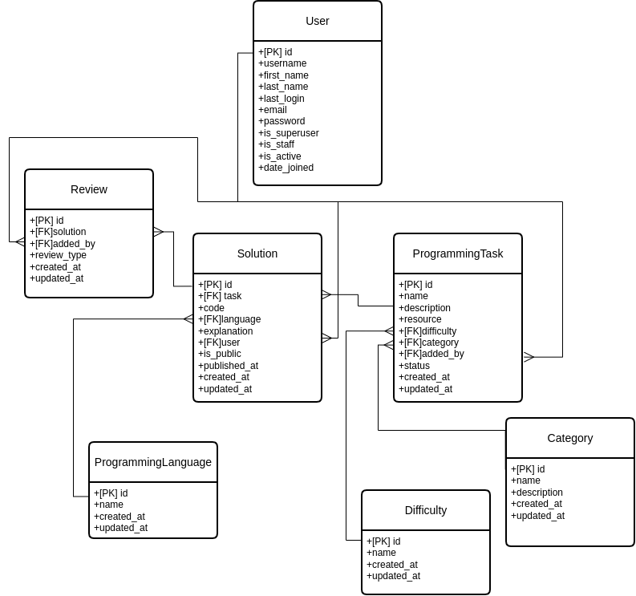

# Codeyard — Платформа для обмена решениями программистов

**Codeyard** — это современная веб-платформа для хранения решений задач по программированию. Пользователи создают задачи по программированию, добавляют и публикуют решения с объяснениями и получают отзывы от сообщества.
Продукт позволяет решить проблему "разрозненности" решений задач по программированию по разным платформам (Решал на GfG, acmp.ru и т.д), но тяжело найти решение к задаче, т.к надо ее сначала найти на конкретной платформе, а потом там искать решение в интерфейсе платформы (если предоставляется). Решает это путем сохранения задач и решений к ним внутри себя. По сути, это личный “каталог задач” с возможностью хранить решение, объяснение и ссылки на источники. В дальнейшем может развиваться как в целом платформа для кодинга.

---

## Основные возможности

- **Создание и управление задачами** — Пользователи могут создавать задачи с описанием и источником
- **Добавление и публикация решений** — Можно загружать код с объяснениями к своим или публичным задачам
- **Система оценок** — Можно оставлять отзывы на решения других пользователей
- **Контроль видимости** — Можно выбирать, видны ли мои задачи и решения только вам или всем пользователям
- **JWT аутентификация** — Безопасная авторизация с токенами и HttpOnly cookies
- **Rate limiting** — Защита от перегрузки и bruteforce атак
- **Полная валидация** — XSS защита, проверка длины полей, валидация URL
- **REST API с документацией** — Swagger UI и ReDoc для интеграции
- **Полное тестирование** — 37 тестов, покрывающих все критические пути

---

## Технологический стек

### Backend
- **Python 3.10+** — язык программирования
- **Django 5.2.8** — веб-фреймворк
- **Django REST Framework 3.15.2** — создание REST API
- **djangorestframework-simplejwt** — JWT аутентификация
- **django-ratelimit** — защита от перегрузки
- **drf-spectacular** — автоматическая документация API

### База данных
- **SQLite** — для разработки
- **PostgreSQL** — для production (готово к использованию)

### Фронтенд
- **Next.js 15** — React фреймворк
- **TypeScript** — типизированный JavaScript
- **TailwindCSS** — стили
- **Zustand** — управление состоянием
- **React Query** — кэширование и синхронизация данных

### Инструменты
- **Git** — контроль версий
- **Docker** — готово к контейнеризации
- **pytest** — тестирование backend
- **Jest** — тестирование frontend

---

## 📦 Установка и запуск

### Требования
- Python 3.10+
- Node.js 18+ (для фронтенда)
- Git

### Шаг 1: Клонирование репозитория

```bash
git clone https://github.com/BanderoLio/codeyard.git
cd codeyard
```

### Шаг 2: Настройка Backend

#### 2.1 Создание виртуального окружения
```bash
python -m venv .venv

# На Linux/Mac:
source .venv/bin/activate

# На Windows:
.venv\Scripts\activate
```

#### 2.2 Установка зависимостей
```bash
cd backend
pip install -r requirements.txt
```

#### 2.3 Настройка переменных окружения
```bash
# Скопировать пример конфигурации
cp backend/.env.example backend/.env

# Отредактировать .env файл, если нужно:
# - SECRET_KEY (сгенерируется автоматически)
# - DATABASE_URL (по умолчанию SQLite)
# - DEBUG (False для production)
```

#### 2.4 Миграции БД
```bash
python manage.py migrate
```

#### 2.5 Загрузка начальных данных
```bash
python manage.py seed_data
```

#### 2.6 Создание суперюзера (необязательно)
```bash
python manage.py createsuperuser
```

#### 2.7 Запуск development сервера
```bash
python manage.py runserver 0.0.0.0:8000
```

Backend будет доступен на: http://localhost:8000

### Шаг 3: Настройка Frontend

#### 3.1 Установка зависимостей
```bash
cd ../frontend
npm install

pnpm install
```

#### 3.2 Запуск development сервера
```bash
npm run dev

pnpm dev
```

Frontend будет доступен на: http://localhost:3000

---

## API Документация

### Доступ к документации
- **Swagger UI**: http://localhost:8000/api/docs/
- **ReDoc**: http://localhost:8000/api/redoc/

### Основные эндпоинты

#### Аутентификация
- `POST /api/auth/register/` — Регистрация нового пользователя
- `POST /api/auth/login/` — Вход (получение JWT токена)
- `POST /api/auth/refresh/` — Обновление токена
- `POST /api/auth/logout/` — Выход
- `GET /api/auth/me/` — Информация о текущем пользователе

#### Задачи
- `GET /api/tasks/` — Список задач (с фильтрацией и поиском)
- `POST /api/tasks/` — Создание новой задачи
- `GET /api/tasks/{id}/` — Детали задачи
- `PATCH /api/tasks/{id}/` — Обновление задачи (только автор)
- `DELETE /api/tasks/{id}/` — Удаление задачи (только автор)

#### Решения
- `GET /api/solutions/` — Список решений
- `POST /api/solutions/` — Создание решения
- `GET /api/solutions/{id}/` — Детали решения
- `PATCH /api/solutions/{id}/publish/` — Публикация/скрытие решения
- `DELETE /api/solutions/{id}/` — Удаление решения (только автор)

#### Отзывы
- `GET /api/reviews/` — Список отзывов
- `POST /api/reviews/` — Добавление отзыва
- `PATCH /api/reviews/{id}/` — Обновление отзыва
- `DELETE /api/reviews/{id}/` — Удаление отзыва

#### Справочники
- `GET /api/categories/` — Категории (кэшировано 1 час)
- `GET /api/difficulties/` — Уровни сложности (кэшировано 1 час)
- `GET /api/languages/` — Языки программирования (кэшировано 1 час)

---

## Архитектура


### Структура Backend

```
backend/
├── accounts/              # Приложение для аутентификации
│   ├── models.py         # Модели пользователей
│   ├── serializers.py    # Сериализаторы (регистрация, профиль)
│   ├── views.py          # Эндпоинты аутентификации
│   ├── authentication.py  # JWT логика
│   └── tests.py          # Тесты аутентификации
│
├── catalog/              # Приложение для задач/решений
│   ├── models.py         # Модели (Task, Solution, Review)
│   ├── serializers.py    # Сериализаторы
│   ├── views.py          # REST ViewSets
│   ├── services.py       # Бизнес-логика
│   ├── validators.py     # Валидация входных данных
│   ├── filters.py        # Фильтрация и поиск
│   ├── test_api.py       # API тесты (17 тестов)
│   └── test_services.py  # Тесты сервисов (10 тестов)
│
├── common/               # Общие компоненты
│   ├── permissions.py    # Классы прав доступа
│   ├── exception_handlers.py  # Обработка ошибок
│   ├── cache_utils.py    # Утилиты кэширования
│   └── mixins.py         # Базовые миксины
│
├── backend/              # Конфигурация Django
│   ├── settings.py       # Параметры проекта
│   ├── urls.py           # Маршруты
│   └── wsgi.py           # WSGI приложение
│
├── manage.py             # CLI инструмент Django
├── requirements.txt      # Зависимости Python
└── README.md            # Документация Backend
```

### База данных




---

## Тестирование

### Backend тесты

```bash
cd backend

# Запуск всех тестов
python manage.py test --verbosity 2

# Запуск тестов определённого модуля
python manage.py test catalog.test_api

# Запуск с покрытием (требуется coverage)
pip install coverage
coverage run --source='.' manage.py test
coverage report
```

**Результаты:** 
- **37/37 тестов ПРОХОДЯТ** ✅
- **Категории тестов:**
  - Аутентификация: 10 тестов
  - API задач: 8 тестов
  - API решений: 5 тестов
  - API отзывов: 4 тестов
  - Сервисы: 10 тестов


---

## Безопасность

### Реализованные меры

- ✅ **PBKDF2 хеширование паролей** — Django встроенный алгоритм с салтом
- ✅ **CSRF защита** — Встроенная в Django
- ✅ **SQL injection защита** — Использование ORM
- ✅ **Rate limiting** — Защита от brute-force атак:
  - Login: 5 попыток/минуту
  - Register: 3 попытки/минуту
  - API CRUD: 100 запросов/минуту
- ✅ **JWT с HttpOnly cookies** — Безопасное хранение токенов
- ✅ **Валидация входных данных** — Проверка длины, типа, формата
- ✅ **Secure headers** — HSTS, CSP, X-Frame-Options (production)
- ✅ **Логирование** — Структурированное логирование без чувствительных данных

---

## Авторы:
**Ганьшин В.М. & Гордиенко А.О.**

---
